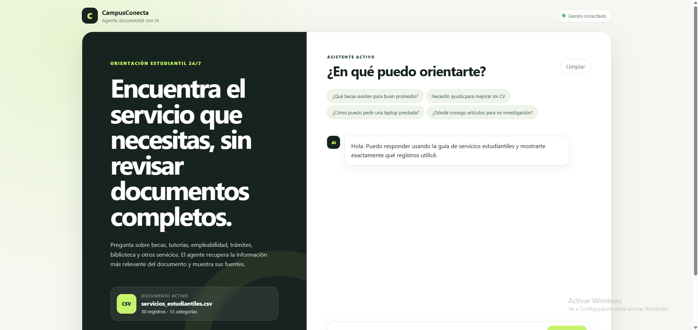

CampusConecta AI:
Agente de inteligencia artificial que responde preguntas de estudiantes sobre los servicios estudiantiles de una universidad (becas, tutorías, bienestar, etc.), a partir de un documento interno, citando siempre la fuente utilizada.

Descripción general:
Cualquier colaborador/estudiante puede escribirle una pregunta en lenguaje natural al agente (por ejemplo "¿qué becas existen para buen promedio?") y recibir una respuesta clara, generada a partir del contenido real del documento `data/servicios_estudiantiles.csv`, junto con las fuentes (servicio, categoría, contacto, enlace) que respaldan esa respuesta.

Si el agente no encuentra información suficiente, lo indica explícitamente en lugar de inventar una respuesta.

## Arquitectura

```
Pregunta del usuario (frontend)
        │
        ▼
   FastAPI (app/main.py) ── endpoint /api/ask
        │
        ▼
  CampusAgent (app/services/agent.py)
        │
        ├─► DocumentLoader (app/services/document_loader.py)
        │      Carga y transforma el CSV/PDF en "chunks" con metadatos
        │
        ├─► HybridRetriever (app/services/retriever.py)
        │      Búsqueda semántica con TF-IDF + coincidencia de palabras clave
        │      → selecciona los fragmentos más relevantes
        │
        └─► Generación de respuesta
               • Si hay GEMINI_API_KEY → LLM (Gemini) responde usando SOLO
                 el contexto recuperado y cita las fuentes.
               • Si no hay API key → modo de respaldo (extractive_fallback),
                 que arma la respuesta directamente desde el registro más
                 relevante del documento.
        │
        ▼
  Respuesta + fuentes → Frontend (app/static)
```

Flujo de datos: CSV → `DocumentLoader` (chunking + metadatos) → `HybridRetriever` (indexación TF-IDF) → `CampusAgent` (recuperación + generación) → API REST → interfaz web.

## Tecnologías utilizadas

| Componente | Tecnología |
|---|---|
| Backend / API | Python 3.12, FastAPI, Uvicorn |
| Recuperación de información | scikit-learn (TF-IDF + similitud coseno), coincidencia de palabras clave |
| Lectura de documentos | `pypdf` (PDF), `csv` nativo (CSV) |
| Modelo de lenguaje (LLM) | Google Gemini (`google-genai`), con modo de respaldo sin LLM |
| Validación de datos | Pydantic |
| Frontend | HTML, CSS y JavaScript vanilla (`app/static`) |
| Pruebas | Pytest, `httpx`, `TestClient` de FastAPI |
| Contenedores | Docker |
| Nube | Oracle Cloud Infrastructure (OCI) — Container Instances |

## Cómo ejecutar el proyecto localmente

1. Clonar el repositorio
```bash
git clone https://github.com/Johann06-gh/CampusConecta-AI.git
cd CampusConecta-AI
```

2. Crear entorno virtual e instalar dependencias
```bash
python -m venv venv
source venv/bin/activate   # En Windows: venv\Scripts\activate
pip install -r requirements.txt
```

3. Configurar variables de entorno
Copia el archivo de ejemplo y completa tu clave de Gemini (opcional pero recomendado):
```bash
cp .env.example .env
```
Variables disponibles:

| Variable | Descripción | Valor por defecto |
|---|---|---|
| `APP_NAME` | Nombre de la aplicación | `CampusConecta AI` |
| `DATA_PATH` | Ruta al documento fuente (CSV o PDF) | `data/servicios_estudiantiles.csv` |
| `GEMINI_API_KEY` | Clave de la API de Gemini. Sin ella, el agente responde en modo de respaldo (sin LLM) | *(vacío)* |
| `GEMINI_MODEL` | Modelo de Gemini a usar | `gemini-2.5-flash` |
| `TOP_K` | Cantidad de fragmentos recuperados por pregunta | `4` |
| `MIN_RELEVANCE` | Umbral mínimo de relevancia para responder | `0.05` |
| `ALLOW_FALLBACK` | Si el LLM falla, usar respuesta de respaldo | `true` |

> Puedes obtener una clave gratuita de Gemini en https://aistudio.google.com/apikey

4. Levantar el servidor
```bash
uvicorn app.main:app --reload
```
Abre en el navegador: http://localhost:8000

5. Ejecutar las pruebas
```bash
pytest
```

6. Ejecutar con Docker
```bash
docker build -t campusconecta-ai .
docker run -p 8080:8080 --env-file .env campusconecta-ai
```

Ejemplos de preguntas que el agente puede responder:

- "¿Qué becas existen para buen promedio?"
- "Necesito ayuda para mejorar mi CV"
- "¿Cómo puedo pedir una laptop prestada?"
- "¿Dónde consigo artículos para mi investigación?"
- "¿Qué apoyo existe si tengo dificultades en matemática?"
- "¿Hay atención psicológica para estudiantes?"

Ejemplo de respuesta generada:

Pregunta: Puedo pedir una computadora prestada?"

Respuesta del agente:
> Sí. El servicio relacionado es Préstamo de laptops, disponible para estudiantes matriculados que lo soliciten con anticipación en el horario indicado. Puedes contactar al área correspondiente para conocer los requisitos y reservar tu equipo.
>
> Fuentes: [Préstamo de laptops — servicios_estudiantiles.csv]

## Despliegue en OCI

El proyecto está preparado para desplegarse como **OCI Container Instance**. La guía completa paso a paso está en [`docs/DEPLOY_OCI.md`](docs/DEPLOY_OCI.md).

**Aplicación desplegada:** http://161.153.194.42:8080/



## Estructura del proyecto

```
CampusConecta-AI/
├── app/
│   ├── main.py                 # Endpoints de la API (FastAPI)
│   ├── schemas.py               # Modelos de entrada/salida (Pydantic)
│   ├── core/config.py           # Configuración y variables de entorno
│   ├── services/
│   │   ├── document_loader.py   # Carga y "chunking" de CSV/PDF
│   │   ├── retriever.py         # Búsqueda híbrida (TF-IDF + keywords)
│   │   └── agent.py             # Orquesta recuperación + generación (Gemini/fallback)
│   └── static/                  # Interfaz web (HTML/CSS/JS)
├── data/servicios_estudiantiles.csv   # Documento fuente del agente
├── docs/DEPLOY_OCI.md           # Guía de despliegue en OCI
├── tests/                       # Pruebas automatizadas (pytest)
├── Dockerfile
├── requirements.txt
└── .env.example
```
